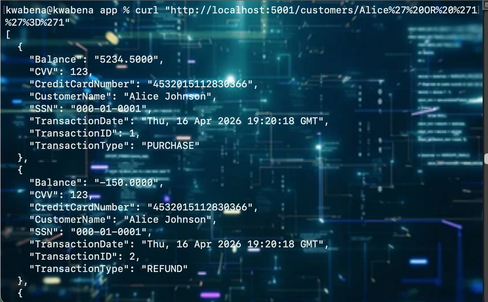
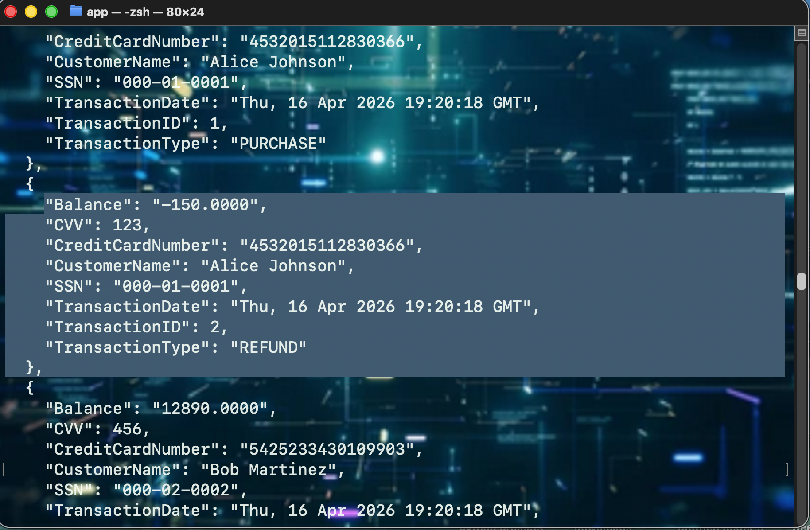
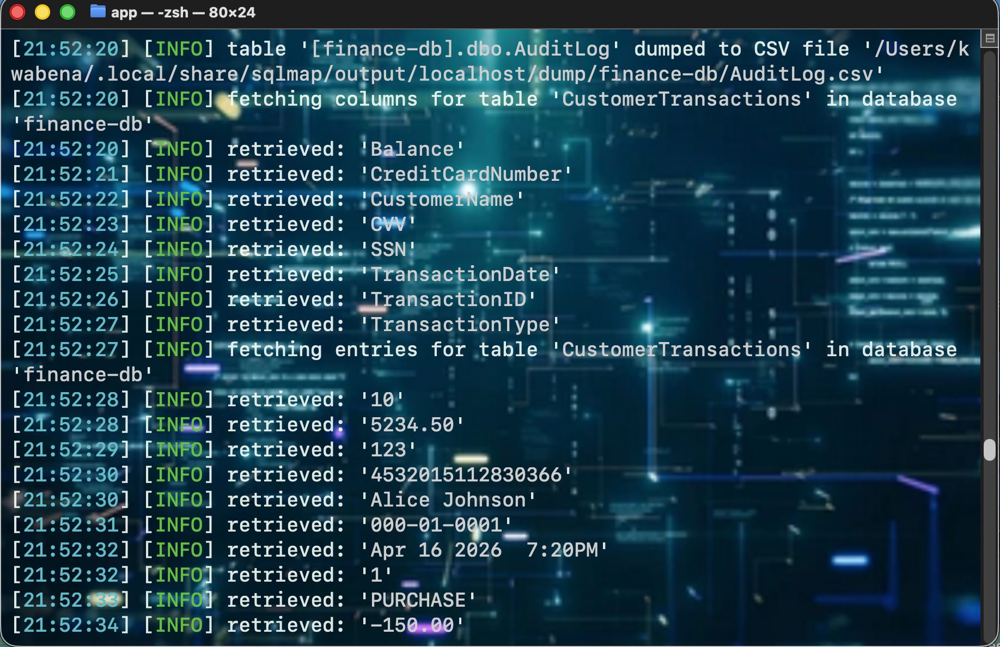

# FinTrack Security Assessment (Azure + SQL Injection)

## 📌 Overview

FinTrack is a financial transaction API deployed on Azure.
This project simulates a real-world **security assessment** of the system, identifying critical vulnerabilities and demonstrating how they can be exploited.

The goal was to evaluate the platform against **PCI-DSS security expectations** and identify risks in handling sensitive financial data.

---

## ⚠️ Key Findings

### 1. SQL Injection (Critical)

* The API constructs SQL queries using unsafe string formatting.
* This allows attackers to inject malicious SQL code.

**Impact:**

* Full database exposure
* Unauthorized access to all customer records

---

### 2. Sensitive Data Exposure

The API returns highly sensitive data in plaintext:

* Credit Card Numbers
* CVV
* Social Security Numbers (SSN)
* Account balances

**Impact:**

* Violates PCI-DSS requirements
* High risk of financial fraud

---

### 3. Hardcoded Secrets

* Database credentials and storage keys were stored in `config.py`

**Impact:**

* Full compromise of database and storage if exposed

---

## 🧪 Exploitation

### 🔹 SQL Injection Payload

```bash
curl "http://localhost:5001/customers/Alice%27%20OR%20%271%27%3D%271"
```

👉 Result: All customer records returned

---

### 🔹 Automated Exploitation (sqlmap)

```bash
sqlmap -u "http://localhost:5001/customers/Alice" --dump
```

👉 Result:

* Database identified (Azure SQL)
* Tables extracted
* Full data dump achieved

---

## 📸 Evidence

### SQL Injection Success


### Sensitive Data Exposure



### Full Database Dump



### sqlmap Exploitation



---

## 🛠️ Remediation Recommendations

* Use parameterized queries (prevent SQL injection)
* Implement Azure Key Vault for secrets management
* Encrypt sensitive data (TDE + Always Encrypted)
* Apply least privilege access to database
* Enable auditing and monitoring

---

## 🧠 Skills Demonstrated

* Web Application Security Testing
* SQL Injection Exploitation
* API Security Analysis
* Azure Cloud Security
* Secure Coding Practices
* Vulnerability Assessment & Reporting

---

## ⚠️ Disclaimer

This project is for educational purposes only.
All data used is simulated and does not represent real individuals.

